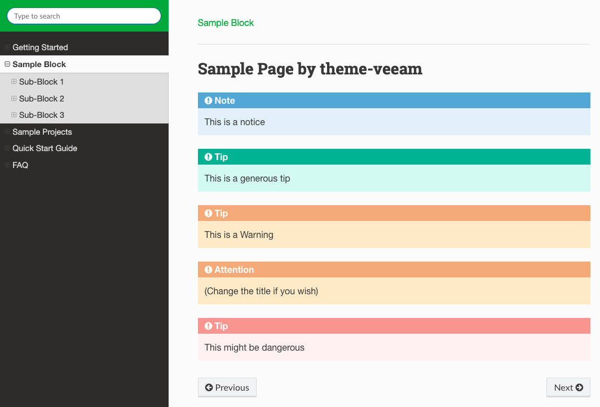

# gitbook-plugin-theme-veeam

This is a "fork" of base theme instead of an extension. That means, some other Gitbook plugins may not work.

Screenshot:



## Features

- A neat sidebar, including the SUMMARY and table of contents of the current page.

## Install

```json
{
    "plugins": ["theme-veeam"]
}
```

Then `gitbook install`.

## Additional Markups

You may create Tip/Warning boxes use these markups:

```text

This is a notice



This is a generous tip



This is a Warning



(Change the title if you wish)



This might be dangerous

```
