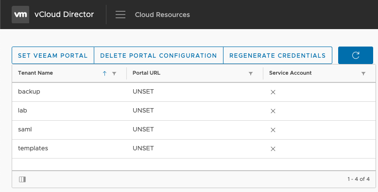

# Veeam Plugin for VCD

## Provider Portal Configuration

These instructions are for Service Providers explaining how to configure the Veeam Plugin for VCD after it's been deployed to vCloud Director.

* Open `Managed Backups` from the VCD Provider Portal
  * *Sample:* `https://vcd.home.lab/provider`

* Click `Set Veeam Portal`

* Enter the public URL and port of your Enterprise Manager
* Click `NEXT`

* Confirm the URL entered is correct
* Click `FINISH`

* At this point, you'll see all VCD Organizations have had their Veeam Portal URL configured.

* VCD Tenants can now use the plugin
  * _This assumes you've already published the Veeam Plugin for VCD to the Tenant(s) and [configured the Tenant Organization in the VSSP](https://helpcenter.veeam.com/docs/backup/em/em_configure_vcd_org.html?ver=95u4)._
