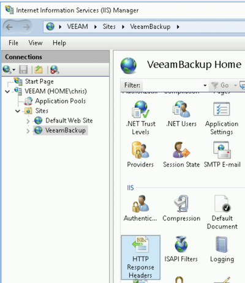
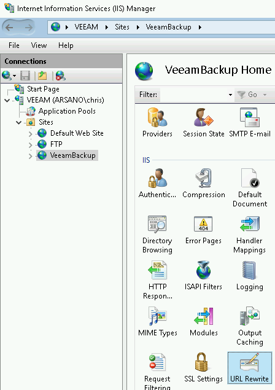

# Veeam Plugin for VCD

## How to uninstall the Veeam Plugin

These instructions explain how to uninstall the Veeam Plugin for VCD. The uninstall process can be broken down into these simple steps:

1. [Remove the Veeam Plugin from VCD](#removing-the-veeam-plugin-from-vcd)
2. [Remove the custom IIS configuration](#removing-the-custom-iis-configuration)

## Removing the Veeam Plugin from VCD

Removal of the Veeam Plugin from VCD depends on the version of VCD that you're running. If you're running VCD 9.7 _or newer_, the recommended method would be using the [VMware Plugin Lifecycle Manager](#using-vmware-plugin-lifecycle-manager). If you're running VCD 9.1 or 9.5, the recommended method would be using [Python](#using-python).

### Using VMware Plugin Lifecycle Manager

* Open `Customize Portal` or `Plugin Lifecycle Management` from the drop-down in the VCD Provider Portal
  * *Example:* `https://vcd.home.lab/provider`


* Mark the checkbox next to the `Veeam Self-Service Portal` plugin and click `DELETE`


* Refresh your browser window (or logout/login to VCD)
* Verify the plugin no longer shows up in the drop-down for VCD


### Using Python

#### Requirements

* Python 3.4+
* Python libraries required:
  * `requests`

#### Steps

* [Download the current plugin](https://github.com/VeeamHub/veeam-plugin-for-vcd/releases/latest)
  * `veeam-vcd-plugin-X.X.X.zip`
* Unzip the plugin to your computer, open a terminal, & navigate to the plugin folder
* Modify the values in the `manage_plugin.json` accordingly for your VCD environment
  * _System Administrator account is required_

_Sample `manage_plugin.json`:_

```json
{
  "username": "administrator",
  "org": "System",
  "password": "P@$$w0rd",
  "vcdUrlBase": "https://vmware.example.com"
}
```

* Execute the Python script below to list already install VCD plugins:

```text
python3 ./manage_plugin.py list
```

* Find plugin named `Veeam Self-Service Portal by Veeam` and copy the `ID` field as shown below


* Execute the Python script below to remove the plugin from VCD:

```text
python3 ./manage_plugin.py unregister <plugin-id>
```

* Refresh your browser window (or logout/login to VCD)
* Verify the plugin no longer shows up in the drop-down for VCD


## Removing the custom IIS configuration

In this step, we will be removing any custom IIS configurations we applied when installing the plugin.

### Remove HTTP Response Headers

Please follow the steps below:

* On your EM server, open `Internet Information Services (IIS) Manager`
* Navigate to the `VeeamBackup` site (see screenshot below) and open `HTTP Response Headers`



* Delete ALL headers present

### Remove URL Rewrite Rules

If the version of Enterprise Manager you're running is v10 or newer, you'll also need to remove the following additional configuration:

* On your EM server, open `Internet Information Services (IIS) Manager`
* Navigate to the `VeeamBackup` site (see screenshot below) and open `URL Rewrite`



* Delete the following *Outbound Rule*: `Allow iframe for vCloud`
* Delete the following *Precondition for Outbound Rules*: `vCloud`
