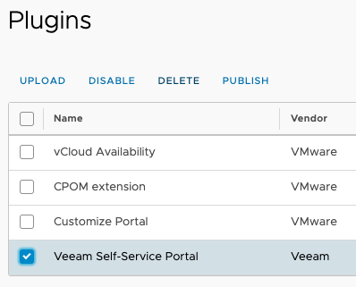
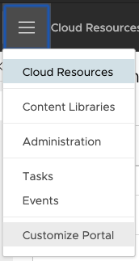
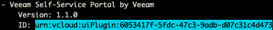

# Veeam Plugin for vCD

## How to upgrade the Veeam Plugin

These instructions are for Service Providers explaining how to upgrade the Veeam Plugin for vCD to the latest version. The upgrade process can be broken down into these simple steps:

1. Remove the current Veeam Plugin from vCD
2. [Follow normal plugin Installation/Configuration Steps](/#steps)

## Removing the Veeam Plugin from vCD

Removal of the Veeam Plugin from vCD depends on the version of vCD that you're running. If you're running vCD 9.7 _or newer_, the recommended method would be using the [VMware Plugin Lifecycle Manager](#using-vmware-plugin-lifecycle-manager). If you're running vCD 9.1 or 9.5, the recommended method would be using [Python](#using-python).

### Using VMware Plugin Lifecycle Manager

* Open `Customize Portal` or `Plugin Lifecycle Management` from the drop-down in the vCD Provider Portal
  * *Example:* `https://vcd.home.lab/provider`


* Mark the checkbox next to the `Veeam Self-Service Portal` plugin and click `DELETE`



* Refresh your browser window (or logout/login to vCD)
* Verify the plugin no longer shows up in the drop-down for vCD



* You can now proceed with the [normal plugin Installation/Configuration Steps](/#steps)

### Using Python

#### Requirements

* Python 3.4+
* Python libraries required:
  * `requests`

#### Steps

* [Download the current plugin](https://github.com/VeeamHub/veeam-plugin-for-vcd/releases/latest)
  * `veeam-vcd-plugin-X.X.X.zip`
* Unzip the plugin to your computer, open a terminal, & navigate to the plugin folder
* Modify the values in the `manage_plugin.json` accordingly for your vCD environment
  * _System Administrator account is required_

_Sample `manage_plugin.json`:_

```json
{
  "username": "administrator",
  "org": "System",
  "password": "P@$$w0rd",
  "vcdUrlBase": "https://vmware.example.com"
}
```

* Execute the Python script below to list already install vCD plugins:

```text
python3 ./manage_plugin.py list
```

* Find plugin named `Veeam Self-Service Portal by Veeam` and copy the `ID` field as shown below



* Execute the Python script below to remove the plugin from vCD:

```text
python3 ./manage_plugin.py unregister <plugin-id>
```

* Refresh your browser window (or logout/login to vCD)
* Verify the plugin no longer shows up in the drop-down for vCD


* You can now proceed with the [normal plugin Installation/Configuration Steps](/#steps)
