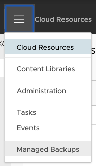
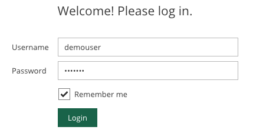

# Veeam Plugin for vCD

## Tenant Portal Usage

These instructions are for Tenants to explain the recommended method for using the Veeam Plugin for vCD.

* Tenant logs in to vCloud Director
* Open `Managed Backups` from the vCD drop-down list

* At the Veeam Portal, login using the same credentials as used for vCloud Director.
  * *Check box `Remember me` so that credentials to be cached*

* Once logged in, [Veeam Documentation](https://helpcenter.veeam.com/docs/backup/vsphere/vcloud_director.html?ver=95u4) should be referenced for further instructions if required.
