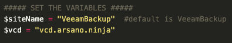
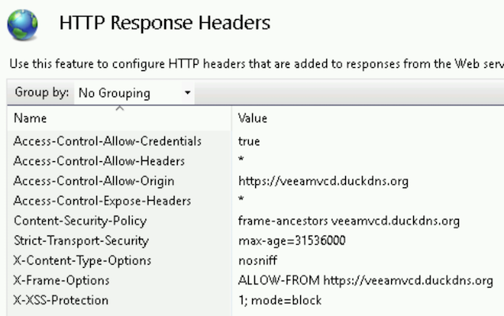
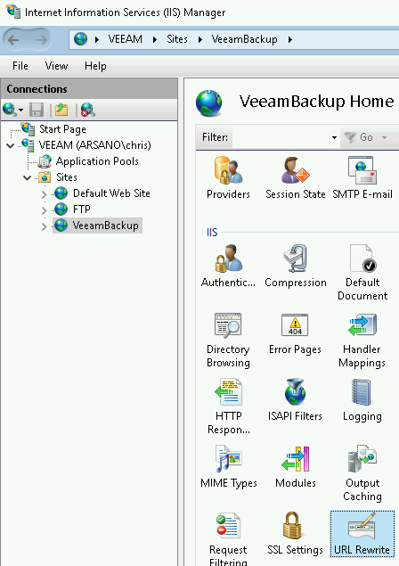

# Veeam vCD Self-Service Backup Portal (VSSP)


The configuration below must be performed any time you install/upgrade Enterprise Manager.


## IIS Configuration

As a secure web application, we'll need to make a few minor adjustments to the Enterprise Manager (EM) web server to avoid [CORS](https://en.wikipedia.org/wiki/Cross-origin_resource_sharing) policy violations.

### Automated Configuration

Included with the [Release Files](https://github.com/VeeamHub/veeam-plugin-for-vcd/releases/latest) is a PowerShell script to automate the IIS configuration. Using this script is super easy:

* Copy the `Set-IIS-Config.ps1` script to the Enterprise Manager server
* Edit the script and update the variables in the script accordingly to your environment

* Run the script
* Upon successful completion of the script, your IIS configuration is complete and you can proceed to the next step: [Veeam Plugin Deployment](plugin-deployment-methods.html)

### Manual Configuration

Please follow the steps below:

* On your EM server, open `Internet Information Services (IIS) Manager`
* Navigate to the `VeeamBackup` site (see screenshot below) and open `HTTP Response Headers`

* Add/Update the below entries:
  * Access-Control-Allow-Credentials: `true`
  * Access-Control-Allow-Headers: `*`
  * Access-Control-Allow-Origin: `<vCD URL>`
  * Access-Control-Expose-Headers: `*`
  * X-Frame-Options: `ALLOW-FROM <vCD URL>`
  * Content-Security-Policy: `frame-ancestors <vCD FQDN>`
    * _Content-Security-Policy is not required for EM v10_

Note the screenshot below. In this example, the vCD public URL is `https://veeamvcd.duckdns.org`.

#### Enterprise Manager v10

If version of Enterprise Manager you're running is v10 or newer, you'll also need the following additional configuration:

* On your EM server, open `Internet Information Services (IIS) Manager`
* Navigate to the `VeeamBackup` site (see screenshot below) and open `URL Rewrite`

* Create the following `Precondition for Outbound Rules`:
  * Name: `vCloud`
  * Using: `Regular Expressions`
  * Logical grouping: `Match All`
  * Condition input: `{REQUEST_URI}`
  * Check if input string: `Matches the Pattern`
  * Pattern: `^.*/vCloud/.*$`
  * Ignore case: _checkbox checked_
* Create the following `Outbound Rule`:
  * Match
    * Name: `Allow iframe for vCloud`
    * Precondition: `vCloud`
    * Matching scope: `Server Variable`
    * Variable name: `RESPONSE_Content-Security-Policy`
    * Variable value: `Matches the Pattern`
    * Using: `Wildcards`
    * Pattern: `*`
    * Ignore case: _checkbox checked_
  * Conditions
    * Logical grouping: `Match All`
    * Condition input: `{RESPONSE_Content-Security-Policy}`
    * Check if input string: `Matches the Pattern`
    * Pattern: `*;*;*;*;*;*;*;*;*;*;*;*;`
    * Ignore case: _checkbox checked_
    * Track capture groups across conditions: _checkbox checked_
  * Action
    * Action type: `Rewrite`
    * Action Properties Value: `{C:1};{C:2};{C:3};{C:4};{C:5};{C:6};{C:7};{C:8};{C:9};{C:10};{C:11}; frame-ancestors <vCD FQDN>;`
      * Example: _frame-ancestors veeamvcd.duckdns.org_
    * Replace existing server variable value: _checkbox checked_
