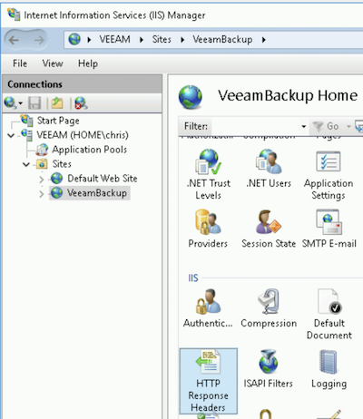

# Veeam vCD Self-Service Backup Portal (VSSP)

## IIS Configuration

As a secure web application, we'll need to make a few minor adjustments to the Enterprise Manager (EM) web server to avoid [CORS](https://en.wikipedia.org/wiki/Cross-origin_resource_sharing) policy violations. Please follow these required steps:

* On your EM server, open `Internet Information Services (IIS) Manager`
* Navigate to the `VeeamBackup` site (see screenshot below) and open `HTTP Response Headers`

* Add/Update the below entries:
  * Access-Control-Allow-Credentials: `true`
  * Access-Control-Allow-Headers: `*`
  * Access-Control-Allow-Origin: `<vCD URL>`
  * Access-Control-Expose-Headers: `*`
  * Content-Security-Policy: `frame-ancestors <vCD FQDN>`
  * X-Frame-Options: `ALLOW-FROM <vCD URL>`

Note the screenshot below. In this example, the vCD public URL is `https://veeamvcd.duckdns.org`.

