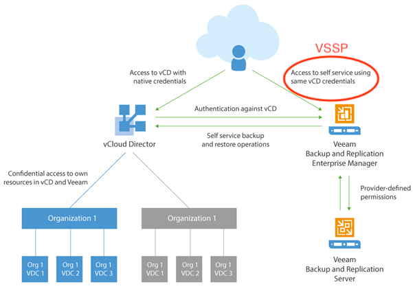

# Veeam vCD Self-Service Backup Portal (VSSP) Setup

The Veeam Plugin for vCD is reliant on the [VSSP](https://helpcenter.veeam.com/docs/backup/em/em_managing_vms_in_vcd_org.html?ver=95u4). It must be fully configured and accessible via the internet prior to plugin installation.

While architecture & design for the VSSP are outside the scope of this documentation, below are some useful links to consider. The only added configuration to the VSSP for the Veeam Plugin can be found [here](vssp-iis-config.md).

* [Veeam Backup Enterprise Manager Documentation](https://helpcenter.veeam.com/docs/backup/em/em_working_with_vcd_vms.html?ver=95u4)
* [Veeam Backup & Replication with vCloud Director Solution Overview](https://kb.vmware.com/s/article/71287)
* [Veeam Backup & Replication Best Practices](https://www.veeambp.com/veeam_enterprise_manager/veeam_vcloud_director_portal) _(outdated but still relevant)_

Here's a high-level view of the architecture and the components involved in the VSSP:

